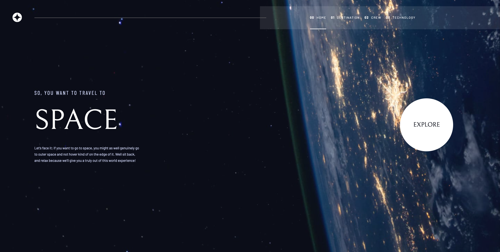
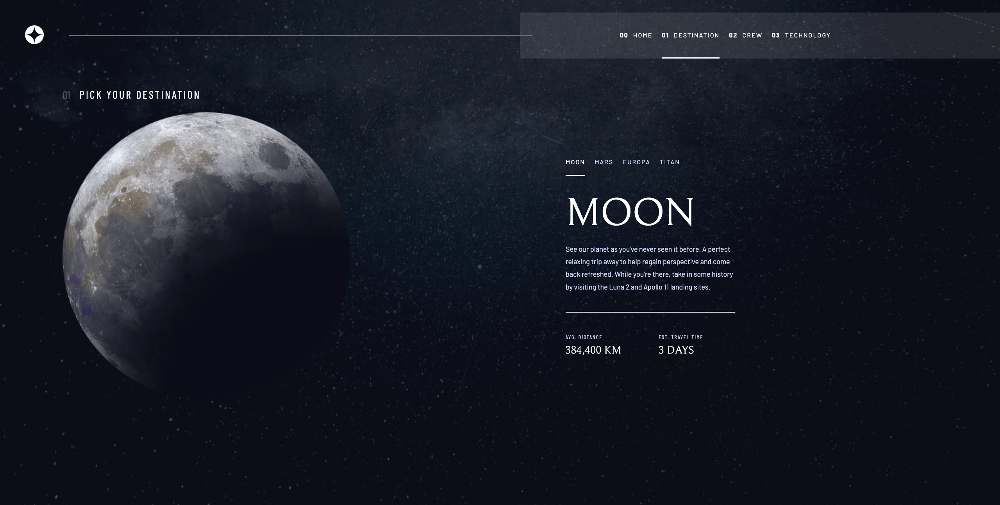
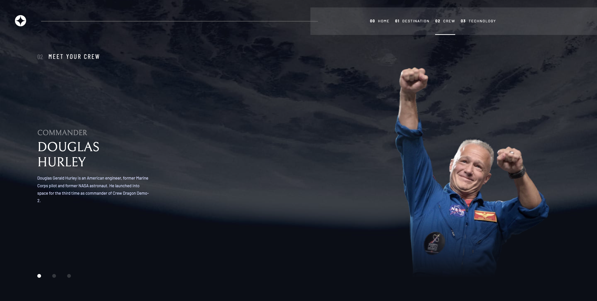
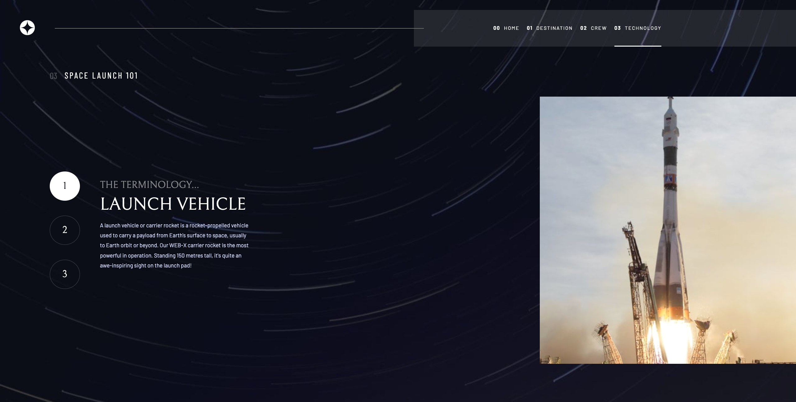

# Space Tourism Website

This dynamic web app driven by Node.js allows users to take a trip to space by exploring various destinations, crew members, and technologies.

## Table of contents

- [Overview](#overview)
  - [Screenshot](#screenshot)
  - [Links](#links)
- [My process](#my-process)
  - [Built with](#built-with)
- [Author](#author)

## Overview

### Screenshots

#### Main Page

#### Destination Page

#### Crew Page

#### Technology Page

### Links

- Live Site URL: [Space Tourism Website](https://web-space-tourism.onrender.com/)

## My process

### Built with

- Semantic HTML5 markup
- Browserside JavaScript
- Node.js backend to serve JSON data and to perform templating with EJS
- CSS custom properties and fonts
- CSS responsive transition animations
- Flexbox
- Grid
- Web-first workflow

## Author

- LinkedIn - [Geylan Kalaf Mohe](https://sa.linkedin.com/in/geylan-kalaf-mohe-1366a220b)
